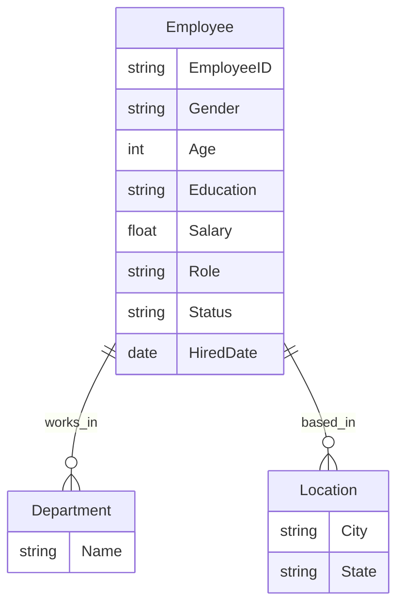

---

# 📊 End-to-End HR Analytics Dashboard with Tableau

> *Created by Adordev*

---

## 1.  Welcome

> This dashboard was created from synthetic data using **ChatGPT** and the **faker** library.

---

## 2.  Project Overview

This end-to-end HR Analytics project showcases how organizations can use data to:

* Monitor workforce distribution
* Track performance and retention
* Analyze salary and education trends
* Drive informed HR decisions

The project leverages **Tableau** for visualization, with support from **Excel/CSV** for data preprocessing.

---

## 3.  Data Description

The dataset includes **7,984 synthetic employee records** with features like:

* **Demographics**: Age, Gender, Location
* **Job Info**: Role, Department, Performance Rating
* **Compensation**: Salary
* **Timeline**: Hire Date, Tenure, Employment Status
* **Education**: Degree Level (High School to PhD)

---

## 4.  Methodology

###  Data Source

* Generated using **ChatGPT** and **Faker.js**
* Loaded in `.csv` format for Tableau connection

### 🔧 Data Cleaning

* Performed in Tableau Prep + Excel
* Tasks included:

  * Null value handling
  * Data type conversions
  * Salary to numeric
  * Date parsing and tenure calculations

### 📈 EDA (Exploratory Data Analysis)

Conducted in Tableau using:

* Heatmaps
* Histograms
* Scatter plots
* KPI cards

---

## 5.  Data Model

Here’s the core schema used in Tableau:

| Field       | Type    | Description           |
| ----------- | ------- | --------------------- |
| Employee ID | String  | Unique identifier     |
| Gender      | String  | Male / Female         |
| Age         | Integer | Employee's age        |
| Role        | String  | Job title             |
| Department  | String  | Department name       |
| Education   | String  | Highest qualification |
| Salary      | Float   | Annual salary (USD)   |
| Hired Date  | Date    | Employment start date |
| Status      | String  | Active or Terminated  |
| Location    | String  | City, State           |

**ER Diagram:**

---

## 6. 📊 Dashboard Views

### 📍 HR Summary Overview

Includes:

* Department headcount
* Gender and education pie charts
* Age & Salary distribution
* Performance by degree level
* Location heatmap

---

### 🧍 HR Details View

Includes:

* Employee-level cards
* Role, Salary, Age, Gender
* Hiring date and current tenure
* Department filters and search

---

## 7. 📈 Key Insights

🔹 **Departments**:

* Operations leads with 2,429 employees
* Sales and Customer Service have high turnover

🔹 **Education & Salary**:

* Salaries increase by degree (up to \~\$93K for PhDs)
* Bachelor’s degree holders are most common

🔹 **Gender**:

* Workforce is 54% Male, 46% Female
* Women consistently earn slightly less

🔹 **Age & Experience**:

* Mid-career (35–50) employees earn the most
* Some tenure spans up to 8–9 years

🔹 **Geography**:

* Most employees are based in Buffalo, NY
* Texas and Florida are emerging hubs

---

## 8. 🧠 Recommendations

✅ Close gender pay gaps
✅ Improve retention in Sales & Customer Service
✅ Promote upskilling to Master’s degrees
✅ Expand Marketing & underrepresented regions
✅ Recruit more balanced age demographics

---

## 9. 🧪 Tools Used

| Tool                | Purpose                                |
| ------------------- | -------------------------------------- |
| **Tableau Desktop** | Building visualizations and dashboards |
| **Tableau Prep**    | Data cleaning & shaping                |
| **Excel/CSV**       | Initial data formatting                |
| **Faker + ChatGPT** | Data generation                        |

---

